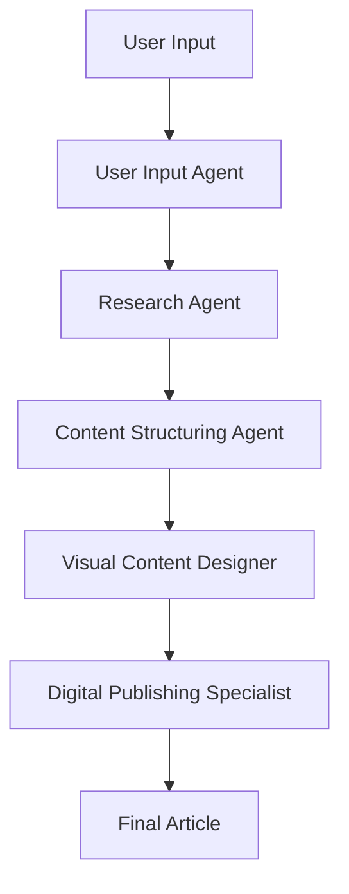

# 🤖 Content Creation System Documentation

## Overview

The Content Creation System is a sophisticated multi-agent AI workflow designed to automatically generate high-quality, professional content from simple topic inputs. It leverages the OpenAI Agents SDK to orchestrate five specialized agents working in sequence to research, structure, and publish engaging articles.

## 🏗️ System Architecture

### Multi-Agent Workflow

The system employs a **sequential agent workflow** where each agent specializes in a specific aspect of content creation:



### Agent Responsibilities

| Agent | Primary Function | Input | Output |
|-------|-----------------|-------|--------|
| **User Input Agent** | Topic validation & enhancement | Raw topic string | Structured input parameters |
| **Research Agent** | Information gathering & analysis | Enhanced topic | Comprehensive research data |
| **Content Structuring Agent** | Content creation & formatting | Research data | Structured markdown content |
| **Visual Content Designer** | Image strategy & descriptions | Article content | Visual content specifications |
| **Digital Publishing Specialist** | Final assembly & publishing | All previous outputs | HTML & Markdown files |

## 🔧 Core Components

### Data Models

The system uses **Pydantic models** for type safety and data validation:

#### UserInput
```python
class UserInput(BaseModel):
    topic: str
    target_audience: str = "general"
    content_type: str = "article" 
    content_length: str = "medium"
    include_technical_details: bool = False
    tone: str = "professional"
```

#### ResearchOutput
```python
class ResearchOutput(BaseModel):
    topic: str
    executive_summary: str
    key_points: List[str]
    detailed_sections: Dict[str, str]
    statistics: List[str]
    expert_quotes: List[str]
    sources: List[str]
    related_topics: List[str]
    research_quality_score: int  # 1-10
```

#### MarkdownContent
```python
class MarkdownContent(BaseModel):
    title: str
    subtitle: str
    summary: str
    table_of_contents: List[str]
    markdown_content: str
    sections: List[str]
    keywords: List[str]
    meta_description: str
    estimated_read_time: str
```

#### PublishedArticle
```python
class PublishedArticle(BaseModel):
    html_file_path: str
    markdown_file_path: str
    article_title: str
    article_url_slug: str
    word_count: int
    sections_count: int
    images_included: int
    publish_date: str
    estimated_read_time: str
    seo_score: int  # 1-10
```

### Configuration System

The `ContentCreationConfig` class controls system behavior:

```python
class ContentCreationConfig(BaseModel):
    output_directory: str = "output"
    generate_real_images: bool = False
    max_word_count: int = 2000
    include_toc: bool = True
    include_references: bool = True
```

## 🚀 Usage Examples

### Basic Usage

```python
import asyncio
from content_creation_system import create_content_workflow

async def main():
    topic = "The Future of Artificial Intelligence"
    result = await create_content_workflow(topic)
    print(f"Generated article: {result.html_file_path}")

asyncio.run(main())
```

### Advanced Configuration

```python
from content_creation_system import (
    create_enhanced_content_workflow, 
    ContentCreationConfig
)

async def create_technical_article():
    config = ContentCreationConfig(
        output_directory="technical_articles",
        generate_real_images=True,
        max_word_count=3000,
        include_toc=True,
        include_references=True
    )
    
    topic = "Machine Learning Model Optimization Techniques"
    result = await create_enhanced_content_workflow(topic, config)
    
    return result
```

### Command Line Interface

```bash
# Basic usage
python content_creation_system.py

# Enhanced version
python enhanced_content_system.py
```

## 🎯 Agent Implementation Details

### 1. User Input Agent

**Purpose**: Validates and enhances user input for optimal content creation.

**Key Features**:
- Topic validation and enhancement
- Audience targeting recommendations
- Content type optimization
- Parameter suggestion

**Example Interaction**:
```
Input: "AI"
Enhanced Output: {
    "topic": "Artificial Intelligence: Applications and Future Trends",
    "target_audience": "general",
    "content_type": "article",
    "tone": "professional"
}
```

### 2. Research Agent

**Purpose**: Conducts comprehensive research on the given topic.

**Research Strategy**:
- Multi-perspective information gathering
- Statistical data collection
- Expert opinion synthesis
- Source validation
- Quality assessment (1-10 score)

**Output Quality Metrics**:
- **8-10**: Excellent research with comprehensive coverage
- **6-7**: Good research with solid foundation
- **4-5**: Adequate research, may need supplementation
- **1-3**: Poor research, requires revision

### 3. Content Structuring Agent

**Purpose**: Transforms research into well-structured, engaging content.

**Content Architecture**:
- **Title & Subtitle**: SEO-optimized, engaging headlines
- **Table of Contents**: Logical content hierarchy
- **Structured Sections**: Clear, digestible content blocks
- **SEO Elements**: Meta descriptions, keywords
- **Reading Time**: Accurate estimates

**Formatting Standards**:
- Markdown with proper heading hierarchy
- Bullet points and numbered lists
- Blockquotes for emphasis
- Code blocks where appropriate

### 4. Visual Content Designer

**Purpose**: Creates comprehensive visual content strategies.

**Design Elements**:
- **Hero Images**: Main visual impact
- **Section Images**: Content support visuals
- **Style Consistency**: Unified visual theme
- **Accessibility**: Alt text and descriptions

**Image Specifications**:
```python
{
    "hero_image": {
        "prompt": "Professional illustration of [topic]",
        "alt_text": "Descriptive alt text",
        "aspect_ratio": "16:9"
    },
    "section_images": [
        {
            "prompt": "Infographic showing [concept]",
            "alt_text": "Chart description",
            "placement": "after_section_2"
        }
    ]
}
```

### 5. Digital Publishing Specialist

**Purpose**: Assembles all components into final publications.

**Publishing Features**:
- **Responsive HTML**: Mobile-friendly design
- **Interactive Elements**: Smooth scrolling, progress bars
- **SEO Optimization**: Meta tags, structured data
- **Accessibility**: WCAG compliance
- **Multi-format Export**: HTML and Markdown

**HTML Template Features**:
- Modern CSS with gradients and animations
- JavaScript interactivity
- Print-friendly styles
- Social media meta tags

## 📊 Output Quality Metrics

### Content Quality Indicators

1. **Research Quality Score** (1-10)
   - Depth of research
   - Source credibility
   - Information accuracy

2. **SEO Score** (1-10)
   - Keyword optimization
   - Meta tag quality
   - Content structure

3. **Readability Metrics**
   - Estimated reading time
   - Content complexity
   - Audience appropriateness

### Performance Benchmarks

| Metric | Target | Typical Range |
|--------|---------|---------------|
| Word Count | 800-2000 | 500-3000 |
| Reading Time | 5-10 minutes | 3-15 minutes |
| Research Quality | 8+ | 6-10 |
| SEO Score | 7+ | 5-10 |
| Generation Time | <5 minutes | 2-8 minutes |

## 🔧 Customization & Extension

### Adding New Agents

1. **Define Agent Class**:
```python
custom_agent = Agent[OutputType](
    name="Custom Agent",
    instructions="Agent instructions...",
    tools=[custom_tool],
    output_type=CustomOutputModel
)
```

2. **Integrate in Workflow**:
```python
async def extended_workflow(topic):
    # ... existing steps ...
    custom_result = await Runner.run(custom_agent, input_data)
    # ... continue workflow ...
```

### Custom Output Formats

```python
class CustomOutput(BaseModel):
    custom_field: str
    additional_data: Dict[str, Any]

# Extend publisher agent
publisher_agent = Agent[CustomOutput](
    name="Custom Publisher",
    instructions="Generate custom format...",
    tools=[custom_publishing_tool],
    output_type=CustomOutput
)
```

### Tool Integration

```python
from agents import function_tool

@function_tool
def custom_research_tool(query: str) -> str:
    """Custom research implementation"""
    # Your custom logic here
    return research_results

# Add to research agent
research_agent.tools.append(custom_research_tool)
```

## 🚨 Error Handling & Recovery

### Common Issues & Solutions

1. **API Rate Limits**
   - Implement exponential backoff
   - Use rate limiting decorators
   - Monitor API usage

2. **Content Quality Issues**
   - Retry with enhanced prompts
   - Implement quality validation
   - Manual review flags

3. **Generation Failures**
   - Graceful degradation
   - Partial result recovery
   - User notification systems

### Error Recovery Patterns

```python
async def robust_content_creation(topic: str, retries: int = 3):
    for attempt in range(retries):
        try:
            return await create_content_workflow(topic)
        except Exception as e:
            if attempt == retries - 1:
                raise
            await asyncio.sleep(2 ** attempt)  # Exponential backoff
```

## 📈 Performance Optimization

### Optimization Strategies

1. **Parallel Processing**
   - Run independent agents concurrently
   - Batch API requests
   - Cache frequently used data

2. **Memory Management**
   - Stream large content
   - Implement pagination
   - Clear unused variables

3. **API Efficiency**
   - Request batching
   - Response caching
   - Connection pooling

### Monitoring & Metrics

- **Response Times**: Track per-agent performance
- **Success Rates**: Monitor completion percentages
- **Resource Usage**: Memory and CPU monitoring
- **API Costs**: Track token usage and costs

## 🔒 Security Considerations

### API Key Management

- Store keys in environment variables
- Use encrypted storage for production
- Implement key rotation policies
- Monitor API usage patterns

### Content Validation

- Input sanitization
- Output content filtering
- Abuse detection mechanisms
- Rate limiting per user

### Data Privacy

- No persistent storage of sensitive data
- Anonymization of user inputs
- Secure file handling
- GDPR compliance considerations

## 🧪 Testing & Validation

### Test Categories

1. **Unit Tests**: Individual agent functionality
2. **Integration Tests**: Multi-agent workflows
3. **Performance Tests**: Speed and resource usage
4. **Quality Tests**: Output validation

### Test Examples

```python
import pytest
from content_creation_system import create_content_workflow

@pytest.mark.asyncio
async def test_basic_content_creation():
    topic = "Test Topic"
    result = await create_content_workflow(topic)
    
    assert result.word_count > 500
    assert result.seo_score >= 5
    assert len(result.sections_count) >= 3

@pytest.mark.asyncio 
async def test_research_quality():
    research_result = await research_agent.run("AI Ethics")
    assert research_result.research_quality_score >= 6
    assert len(research_result.sources) >= 3
```

## 📚 Best Practices

### Content Creation Guidelines

1. **Topic Selection**
   - Be specific and focused
   - Consider audience expertise level
   - Ensure sufficient scope for content

2. **Configuration Tuning**
   - Match content length to topic complexity
   - Choose appropriate tone for audience
   - Enable technical details for expert audiences

3. **Output Review**
   - Validate factual accuracy
   - Check for bias or inappropriate content
   - Ensure proper attribution

### Development Practices

1. **Code Organization**
   - Separate agent definitions
   - Modular tool implementations
   - Clear configuration management

2. **Version Control**
   - Track agent prompt changes
   - Document configuration updates
   - Maintain backward compatibility

3. **Deployment**
   - Environment-specific configurations
   - Monitoring and alerting
   - Graceful error handling

## 🔄 Future Enhancements

### Planned Features

1. **Real-time Image Generation**
   - Integration with DALL-E or Midjourney
   - Custom image style training
   - Automatic image optimization

2. **Multi-language Support**
   - Translation capabilities
   - Locale-specific content adaptation
   - Cultural sensitivity analysis

3. **Advanced Analytics**
   - Content performance tracking
   - A/B testing for different approaches
   - User engagement metrics

4. **Collaborative Features**
   - Multi-user editing
   - Review and approval workflows
   - Version control integration

### Experimental Features

- **Voice-to-Content**: Audio input processing
- **Interactive Content**: Dynamic content generation
- **AI-Human Collaboration**: Human-in-the-loop workflows
- **Content Personalization**: User-specific adaptations

---

## 📞 Support & Community

- **GitHub Issues**: Report bugs and request features
- **Documentation**: Comprehensive guides and tutorials
- **Community Forum**: Discussion and best practices
- **Professional Support**: Enterprise-level assistance

**Made with ❤️ using OpenAI Agents SDK**